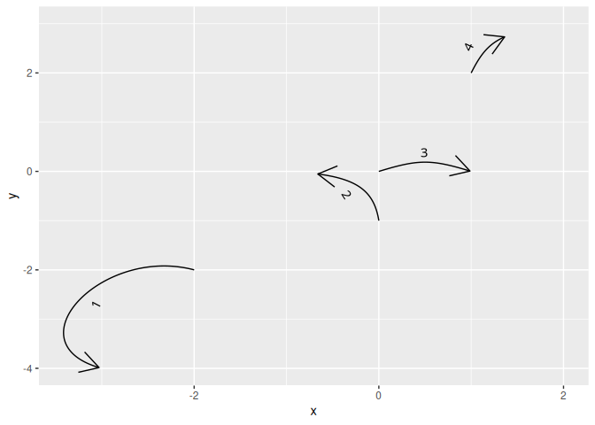

<!-- README.md is generated from README.Rmd. Please edit that file -->

# ggMarquedBezier

<!-- badges: start -->
<!-- badges: end -->

`ggMarquedBezier` provides `ggplot2` layers to draw quadratic Bézier
curves parametrized in the same way as `geom_segment()`, i.e. with `x`,
`y`, `xend`, `yend`, one curve per row of your data.frame.

Key features include:

- A label can be added at the midpoint of the path, and it will follow
  the path’s orientation and angle.
- The curvature is controlled by `angle`, `angle_end`, `strength`, and
  `strength_end`, where angle is the slope of the tangent vector
  relative to the segment and strength is the distance of the control
  point.
- The curve can be customized as in `geom_path()` (color, linetype,
  linewidth, …), and the label can be customized as in `geom_marquee()`
  (color, fill, style, …).
- The arrowheads are drawn separately from the segment and are rendered
  with a solid linetype to circumvent [this
  issue](https://github.com/tidyverse/ggplot2/issues/2442).
- Support `start_cap` and `end_cap`, like `ggraph::geom_edge()`.

### Details

The package provides a ggplot `stat` and a `geom`. `StatBezierSegment`
(with its constructor `stat_bezier_segment()`) is a wrapper around the
internals of `ggforce::stat_bezier()`. It draws the Bézier curves with
our segment-like parametrization. The transformed data can then be used
with any path-like geom that expects `x` and `y` aesthetics, like
`GeomPath`. `GeomMarquedPath` provides a path-like geometry that adds a
label at the midpoint and automatically orients it along the direction
of the path. `geom_bezier_segment()` is the main layer function that we
export; by default it uses `bezier_segment()` to draw the path.

## Installation

You can install the development version of ggMarquedBezier from
[GitHub](https://github.com/) with:

``` r
# install.packages("devtools")
devtools::install_github("fmarotta/ggMarquedBezier")
```

## Example

This is a basic example which shows you how to solve a common problem:

``` r
library(ggMarquedBezier)
library(ggplot2)

d <- data.frame(
  id = c(1, 2, 3, 4),
  x = c(-2, 0, 0, 1),
  y = c(-2, -1, 0, 2),
  xend = c(-3, -1, 1, 2),
  yend = c(-4, 0, 0, 3),
  angle = c(-90, -40, 30, 30),
  # geometry(), circle(), and square() are also re-exported from ggraph for convenience
  end_cap = ggraph::circle(c(0, 0.5, 0, 1))
)

ggplot(d) +
  geom_marqued_bezier(
    aes(
      x = x,
      y = y,
      xend = xend,
      yend = yend,
      label = id,
      angle = angle,
      end_cap = end_cap,
      label_nudge = 0.2,
    ),
    arrow = arrow()
  )
```


